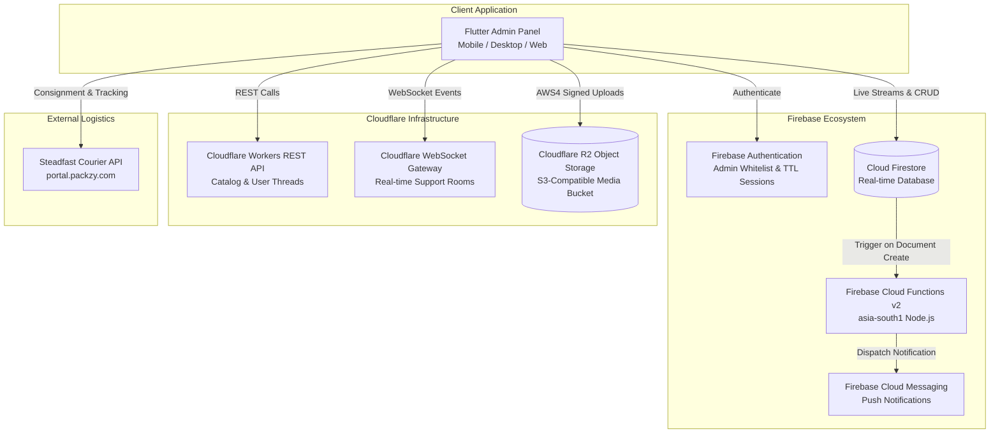
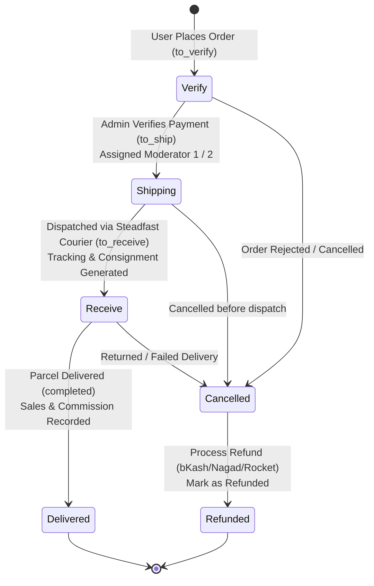

# 🛍️ DADU Admin Panel

[](https://flutter.dev)
[](https://dart.dev)
[](https://firebase.google.com)
[](https://www.cloudflare.com)
[](https://portal.packzy.com)
[](LICENSE)

A robust, feature-rich administrative control panel and enterprise management application built with **Flutter** for the **DADU E-Commerce** ecosystem. Designed to provide business administrators and moderators with centralized control over orders, product inventory, flash sales, customer communications, courier logistics, marketing promotions, and revenue analytics in real time.

---

## 📑 Table of Contents

- [Overview](#-overview)
- [System Architecture](#-system-architecture)
- [Key Features](#-key-features)
  - [1. Order Lifecycle & Courier Logistics](#1-order-lifecycle--courier-logistics)
  - [2. Product & Inventory Management](#2-product--inventory-management)
  - [3. Marketing & Customer Engagement](#3-marketing--customer-engagement)
  - [4. Real-time Customer Support & Live Chat](#4-real-time-customer-support--live-chat)
  - [5. Review Moderation](#5-review-moderation)
  - [6. Business Intelligence & Analytics](#6-business-intelligence--analytics)
- [Tech Stack & Dependencies](#-tech-stack--dependencies)
- [Project Directory Structure](#-project-directory-structure)
- [Database Schema & Collections](#-database-schema--collections)
- [Environment Configuration](#-environment-configuration)
- [Installation & Getting Started](#-installation--getting-started)
- [Firebase Cloud Functions Deployment](#-firebase-cloud-functions-deployment)
- [Security & Authentication](#-security--authentication)
- [License & Support](#-license--support)

---

## 🌟 Overview

The **DADU Admin Panel** serves as the operational headquarters for the DADU sports & e-commerce shopping platform. It combines real-time data synchronization with Firebase Firestore, direct integration with the **Steadfast Courier API** for automated shipping dispatch, high-performance **Cloudflare R2** object storage for optimized multi-resolution images and voice notes, and a **WebSocket-powered live customer support chat** system.

### Key Highlights
- ⚡ **Real-time Synchronization**: Live updates across all order stages and user activities using Firestore Streams and WebSockets.
- 📦 **Automated Logistics**: 1-click consignment creation, tracking code generation, and live delivery status checks via Steadfast Courier.
- 🖼️ **Dual-Tier Image Optimization**: Automated multi-resolution compression (`img5`, `img20`) and direct AWS4-signed uploads to Cloudflare R2.
- 💬 **Omnichannel Live Support**: WebSocket-based admin chat supporting text, image galleries, audio voice notes, reply quotes, user blocking, and global messaging control.
- 🔔 **Targeted Cloud Messaging**: Push notification center with FCM v2 Cloud Functions supporting broadcast topics, segment-targeted, or single-user alerts with rich media and deep linking.
- 📊 **Financial & Sales Analytics**: Granular order tracking, monthly revenue aggregation, developer commission accounting, and live daily active user metrics.

---

## 🏗️ System Architecture



---

## 🚀 Key Features

### 1. Order Lifecycle & Courier Logistics

The order management pipeline follows a strict, verifiable lifecycle with automated round-robin moderator assignment and parcel tracking:



- **Verify Orders (`verify.dart`)**:
  - Review customer orders, shipping address, order items, and payment references (bKash, Nagad, Rocket, COD).
  - One-click order approval with automated round-robin moderator allocation (`moderator-1` / `moderator-2`).
  - Move orders to shipping queue or cancel with structured reason logging.
- **Shipping Dispatch (`shipping.dart`)**:
  - Direct integration with Steadfast Courier API (`/create_order`).
  - Automatically submits invoice, recipient details, and COD (Cash on Delivery) amount to generate consignment IDs and tracking codes.
  - Automatically shifts orders to `to_receive` status.
- **In-Transit Tracking (`receive.dart`)**:
  - Live automated status check against Steadfast Courier API by Consignment ID (CID), Tracking Code, or Invoice ID.
  - Automatic resolution to "Delivered" upon courier confirmation.
- **Delivered Orders (`delivered.dart`)**:
  - Archive of fulfilled orders with delivery timestamps, item breakdown, and delivery fee calculations.
  - Automated recording of sales data and developer commission calculations.
- **Cancelled & Refunds (`cancelled.dart`)**:
  - Non-destructive cancellation tracking retaining full order details, cancellation origin, and timestamp.
  - Customer refund management supporting bKash, Nagad, and Rocket accounts.
  - One-click toggle for refund completion with recorded refund timestamps.
- **Payment Gateway Config (`update_payment.dart`)**:
  - Manage live merchant payment numbers (bKash, Nagad, Rocket) displayed to customers in the mobile app.

---

### 2. Product & Inventory Management

- **Catalog Management (`manage_product.dart`)**:
  - Complete CRUD operations for products with pagination, category filtering, and brand classification.
  - Product specifications: Title, Pricing, Old Price, Stock Status (`Available` / `Not Available`), Sizes, Video Demos, Developer Commission rates, and Free Coin allocations.
  - Dual-compression image pipeline: Compress original images into low-bandwidth (`img5` @ 15% quality) and high-definition (`img20` @ 50% quality) assets uploaded directly to Cloudflare R2.
- **Flash Sales (`flash_sell.dart`)**:
  - Real-time countdown timer configuration for flash sales stored in Firestore.
  - Add/remove items with discounted flash prices and automatic Firestore schema overlaying.
- **New Arrivals & Gift Items (`new_arrival.dart`, `gift_item.dart`)**:
  - Tag catalog items as new arrivals or assign them as complimentary gift items for marketing campaigns.
- **Fuzzy Product Search (`search.dart`)**:
  - High-speed product search engine with fuzzy matching across names, categories, and stock availability.

---

### 3. Marketing & Customer Engagement

- **Promotional Banners (`banner.dart`)**:
  - Upload, compress, and activate carousel promotional banners for the main user app.
- **Lucky Draw System (`draw.dart`)**:
  - Automated lucky draw for customers who claimed free gifts.
  - Randomly selects winners, records winner profile (Name, District, Thana, User ID), and resets campaign participants in a single atomic batch transaction.
- **Push Notification Dispatcher (`send_notification.dart`)**:
  - Powered by Firebase Cloud Functions v2 and FCM.
  - Audience targeting options:
    - 📢 **All Users**: Broadcasts to the `allUsers` topic.
    - 👥 **User Segment**: Targets specific segments (e.g. `segment_active`, `segment_inactive`).
    - 👤 **Specific User**: Direct delivery via user ID or email token lookup.
  - Rich notification payloads: Custom image banners, deep links, high-priority delivery flags, and custom notification sound options.

---

### 4. Real-time Customer Support & Live Chat

- **WebSocket Connection (`chat_socket_service.dart`)**:
  - Persistent, low-latency bidirectional WebSocket connection with automatic exponential reconnects.
  - Fallback REST endpoints for message delivery and thread retrieval.
- **Admin Chat Screen (`admin_chat_screen.dart`, `message_threads.dart`)**:
  - Real-time user thread list with live unread badge counters.
  - Typing indicators showing when a customer is typing.
  - Multi-image attachments uploaded to Cloudflare Worker R2 endpoints.
  - In-app Voice Note recording (`record` package) and player (`audioplayers` package) with playback scrubbers.
  - Quoted message replies.
  - Administrative user blocking/unblocking and global messaging master switch.

---

### 5. Review Moderation

- **Admin Reviews (`admin_reviews_screen.dart`)**:
  - Centralized review feed of all customer ratings and feedback.
  - Star rating breakdown, verified purchase badges, review timestamps, and one-click removal of spam/inappropriate reviews.

---

### 6. Business Intelligence & Analytics

- **Sell Analytics (`sell_analytics.dart`)**:
  - Monthly financial aggregates: Total Revenue, Completed Orders Count, Total Products Sold, Delivery Charges Collected, and Total Developer Commissions.
  - Granular sales records audit trail (`sales_records`) with searchable order histories.
- **User Analytics (`user_analytics.dart`)**:
  - Total registered accounts vs. anonymous downloads counter.
  - Real-time active login stream tracking daily active users (DAU) with automatic midnight reset listeners.
  - Recent user login audit trail.

---

## 🛠️ Tech Stack & Dependencies

### Core Framework & State Management
| Technology | Description |
|---|---|
| **Flutter 3.7+ / Dart** | Cross-platform UI toolkit and language |
| **RxDart (`^0.28.0`)** | Reactive functional programming and event streams |
| **SharedPreferences (`^2.5.4`)** | Local persistence for 3-day session expiry and cached state |

### Cloud & Backend Services
| Service / Package | Purpose |
|---|---|
| **Firebase Core (`^3.14.0`)** | Firebase SDK initialization |
| **Firebase Auth (`^5.3.0`)** | Secure authentication and admin token management |
| **Cloud Firestore (`^5.6.9`)** | Real-time NoSQL database for orders, analytics, and settings |
| **Firebase Cloud Functions (v2)** | Serverless Node.js backend for FCM push notification triggers |
| **Cloudflare R2 & Workers** | S3-compatible cloud object storage and REST API backend |
| **WebSocket Channel (`^3.0.1`)** | Real-time bidirectional customer support messaging |
| **Steadfast Courier API** | Automated parcel dispatch, consignment, and delivery status tracking |

### Media & Utility Packages
| Package | Purpose |
|---|---|
| **`flutter_image_compress`** | Quality-based image compression for multi-tier uploads |
| **`record` & `audioplayers`** | Audio recording and playback for customer voice notes |
| **`cached_network_image`** | Memory and disk-cached remote image rendering |
| **`image_picker`** | Image selection from camera or gallery |
| **`fuzzy`** | Approximate string matching for search queries |
| **`crypto`** | SHA-256 and HMAC signing for AWS4 Cloudflare R2 requests |
| **`flutter_dotenv`** | Environment configuration management |
| **`intl`** | Date, currency, and timestamp formatting |

---

## 📁 Project Directory Structure

```text
dadu_admin_panel/
├── .env                              # Environment variables (R2, Steadfast keys)
├── firebase.json                     # Firebase deployment configuration
├── pubspec.yaml                      # Flutter dependencies and asset registrations
├── functions/                        # Firebase Cloud Functions (Node.js)
│   ├── index.js                      # Firestore onCreate triggers for FCM notifications
│   ├── package.json                  # Cloud Functions dependencies
│   └── package-lock.json
│
└── lib/
    ├── main.dart                     # App entry point, session validator & root router
    │
    ├── constants/
    │   └── constants.dart            # Base API URLs, global navigation keys
    │
    ├── exceptions/
    │   └── api_exception.dart        # Custom HTTP & API exception definitions
    │
    ├── models/
    │   └── order_item.dart           # Order and OrderItem data models
    │
    ├── theme/
    │   └── app_theme.dart            # Material 3 light/dark themes, color tokens
    │
    ├── widgets/
    │   ├── banner_card.dart          # Reusable banner card widget
    │   ├── product_card.dart         # Product item card with actions
    │   ├── smooth_slow_scroll_physics.dart # Custom smooth scroll physics
    │   ├── sports_background_pattern.dart  # Custom sports background canvas painter
    │   ├── typing_indicator.dart     # Animated 3-dot typing indicator widget
    │   └── voice_note_player.dart    # Interactive voice note audio player widget
    │
    ├── services/
    │   ├── api_service.dart          # Centralized HTTP client with Firebase token injection
    │   ├── chat_socket_service.dart  # WebSocket client for real-time customer chat
    │   ├── chat_storage_service.dart # Local caching & persistence for chat
    │   ├── database_service.dart     # Firestore transactions, streams, order movements & analytics
    │   ├── image_upload_service.dart # Cloudflare R2 AWS4-signed multipart uploader
    │   ├── image_delete_service.dart # Cloudflare R2 object deletion service
    │   └── steadfast_service.dart    # Steadfast Courier consignment & status API integration
    │
    └── screens/
        ├── auth/
        │   └── login_page.dart       # Admin login with whitelist validation & session TTL
        │
        ├── home/
        │   └── home.dart             # Main dashboard grid with live order badge streams
        │
        ├── orders/
        │   ├── verify.dart           # Pending order verification & moderator assignment
        │   ├── shipping.dart         # Steadfast courier consignment creation
        │   ├── receive.dart          # In-transit tracking and courier status checks
        │   ├── delivered.dart        # Completed orders archive & revenue recording
        │   ├── cancelled.dart        # Non-destructive cancelled orders & refund tracking
        │   └── update_payment.dart   # Admin merchant payment numbers configuration
        │
        ├── products/
        │   ├── manage_product.dart   # Product catalog CRUD with R2 multi-resolution upload
        │   ├── flash_sell.dart       # Flash sale timer and promotional price overrides
        │   ├── new_arrival.dart      # New arrival product tagging
        │   ├── gift_item.dart        # Promotional free gift items management
        │   └── search.dart           # Fuzzy search for inventory products
        │
        ├── marketing/
        │   ├── banner.dart           # App carousel banner management
        │   ├── draw.dart             # Lucky draw winner picker & campaign reset
        │   └── send_notification.dart# Rich push notification dispatcher (All/Segment/User)
        │
        ├── chat/
        │   ├── message_threads.dart  # Customer thread list with unread counters
        │   └── admin_chat_screen.dart# Real-time chat with text, voice notes & images
        │
        ├── reviews/
        │   └── admin_reviews_screen.dart # Customer review moderation and removal
        │
        └── analytics/
            ├── sell_analytics.dart   # Revenue, commissions, order totals & monthly sales
            └── user_analytics.dart   # Registered users, anonymous downloads & live DAU streams
```

---

## 🗄️ Database Schema & Collections

The application utilizes Firebase Cloud Firestore with reactive streams, transactions, and batch writes across the following key collections:

| Collection / Path | Document ID / Structure | Description |
|---|---|---|
| `users/{userId}` | User documents containing array fields: `to_verify`, `to_ship`, `to_receive`, `completed`, `cancelled` | Stores customer profiles, addresses, and order items partitioned across lifecycle arrays |
| `flash_sell_timer/current` | `{ time: Timestamp }` | Stores the active flash sale expiry deadline |
| `flash_sell_products/{productId}` | `{ id, flashSell, price, fl-price, flash-expire, ... }` | Product documents currently enrolled in flash sale deals |
| `product_names/all_product_names` | `{ names: List<String> }` | Cached list of all product titles for autocomplete and search |
| `banners/{bannerId}` | `{ imageUrl: String, createdAt: Timestamp }` | Promotional carousel banner URLs |
| `free_gift/winner` | `{ name, location, user_id, time: Timestamp }` | Record of the latest promotional lucky draw winner |
| `paymentNumber/9O1UpVqUrdyuTqiA3YQH` | `{ number, bkash, nagad, rocket, updatedAt }` | Active merchant payment numbers for customer checkouts |
| `sales_records/{saleId}` | `{ order_id, customerName, phone, total, deliveryCharge, calculatedCommission, monthKey, recordedAt }` | Granular audit trail for completed sales transactions |
| `sell_analytics/{YYYY-MM}` | `{ monthKey, monthName, totalSales, totalOrders, totalProductsCount, totalDeliveryCharges, totalDeveloperCommission }` | Monthly aggregated financial records for business analytics |
| `notifications/{notificationId}` | `{ title, body, audience, segment, userId, image, link, status, processedAt }` | Notification requests consumed by Cloud Functions trigger `sendNotification` |
| `order_push_notifications/{id}` | `{ title, body, userId, email, link, image, createdAt }` | Order status alerts consumed and deleted by Cloud Function `sendOrderPushNotification` |
| `settings/moderator_assignment` | `{ lastIndex: int }` | Round-robin counter state for alternating moderator assignment |

---

## 🔐 Environment Configuration

Create a `.env` file in the project root directory with the following variables:

```env
# Cloudflare R2 Bucket Credentials (S3-Compatible Uploads)
R2_ACCESS_KEY=your_cloudflare_r2_access_key
R2_SECRET_KEY=your_cloudflare_r2_secret_key
R2_BUCKET_NAME=your_r2_bucket_name
R2_ACCOUNT_ID=your_cloudflare_account_id
R2_PUBLIC_BASE_URL=https://your-public-r2-domain.r2.dev

# Steadfast Courier Integration API Keys
steadFast_API_Key=your_steadfast_api_key
steadFast_Secret_Key=your_steadfast_secret_key

# Cloudinary (Optional / Legacy Asset Support)
CLOUDINARY_CLOUD_NAME=your_cloud_name
CLOUDINARY_API_KEY=your_cloudinary_api_key
CLOUDINARY_API_SECRET=your_cloudinary_api_secret
```

> [!IMPORTANT]
> Ensure the `.env` file is included in your `.gitignore` and never committed to public version control. Register the `.env` file under `flutter.assets` in `pubspec.yaml`.

---

## 💻 Installation & Getting Started

### Prerequisites
- **Flutter SDK**: `^3.7.0` (or higher)
- **Dart SDK**: `^3.7.0`
- **Node.js**: `v18+` (for Cloud Functions)
- **Firebase CLI**: `npm install -g firebase-tools`
- **Android Studio / Xcode / VS Code** with Flutter & Dart extensions

### Step-by-Step Setup

1. **Clone the Repository**:
   ```bash
   git clone https://github.com/sayedulmorsalin/DADU_admin_panel.git
   cd dadu_admin_panel
   ```

2. **Install Flutter Dependencies**:
   ```bash
   flutter pub get
   ```

3. **Configure Environment Variables**:
   Create a `.env` file in the root directory following the [Environment Configuration](#-environment-configuration) section above.

4. **Configure Firebase**:
   - Place your `google-services.json` inside `android/app/`.
   - Place your `GoogleService-Info.plist` inside `ios/Runner/`.
   - Ensure the project is linked with `.firebaserc`.

5. **Run the Application**:
   ```bash
   # Run on connected Android device or Emulator
   flutter run

   # Run in release mode
   flutter run --release
   ```

---

## ⚡ Firebase Cloud Functions Deployment

The `functions/` directory contains Firebase Cloud Functions (v2) triggers deployed in region `asia-south1` for handling automated FCM push notifications.

### Deploy Functions

1. **Navigate to the Functions directory**:
   ```bash
   cd functions
   npm install
   ```

2. **Log in to Firebase**:
   ```bash
   firebase login
   ```

3. **Deploy Functions**:
   ```bash
   firebase deploy --only functions
   ```

### Function Handlers
- **`sendNotification`**: Triggers on `notifications/{id}` document creation. Validates audience target (`All Users` via topic `allUsers`, `User Segment` via `segment_{name}`, or `Specific User` via user FCM token) and dispatches rich notifications with delivery status tracking.
- **`sendOrderPushNotification`**: Triggers on `order_push_notifications/{id}` document creation. Sends instant transactional order updates directly to customer devices and automatically removes the document upon execution.

---

## 🛡️ Security & Authentication

- **Admin Whitelisting**: Strict client and server-level authentication verifying authorized admin email accounts.
- **Session Lifetime**: Automated 3-day session expiration managed through `SharedPreferences` timestamps; expired sessions automatically trigger sign-out and route redirection.
- **Bearer Token Authorization**: Centralized `ApiService` automatically attaches verified Firebase ID tokens to all REST and WebSocket requests with automatic token refreshing on 401 Unauthorized responses.
- **AWS Signature Version 4**: Cloudflare R2 uploads and deletes are authenticated via cryptographic HMAC-SHA256 request signatures.

---

## 📄 License & Support

This project is proprietary software developed for the **DADU** E-Commerce platform. All rights reserved.

For technical inquiries, bug reports, or support:
- **Developer**: Sayedul Morsalin
- **Repository**: [sayedulmorsalin/DADU_admin_panel](https://github.com/sayedulmorsalin/DADU_admin_panel)
- **Organization**: DADU Khelaghor
